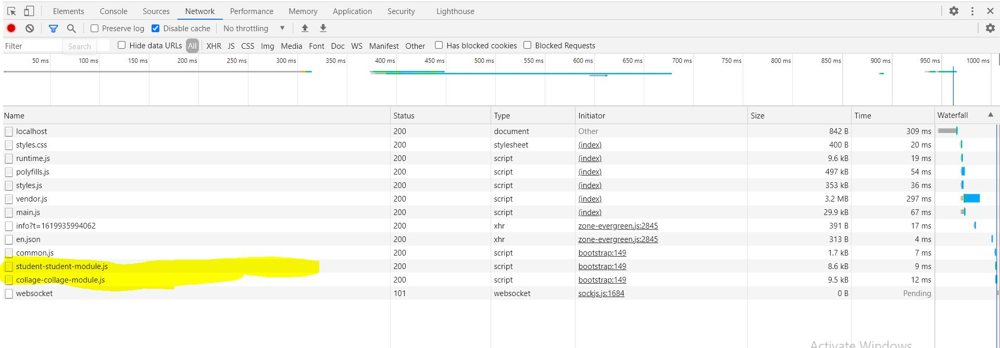

# Angular 2 multiple module sample project

## step to clone it

```git clone 
cd angular-2-multiple-module-sample-project
npm install
ng serve```

Now go to 

## Lazy loading of module

  


## Boostrap 

    Installed bootstrap version ```4.6.0```
  
## Multiple language configurations
    Support for LTR (Left to Right) and (Right to Left)

  

 
  

## Module: share 

    It contains the share components. 
    I have created a header component, but any other components which are need to common for the all components that need to create here.

## Module: core

    It will contains the services only.
    It will imported to AppModule only

## Module: student

    It contains all the components related to studet managements.

## Module: Collage

     It contains all the components related to collage managements.
