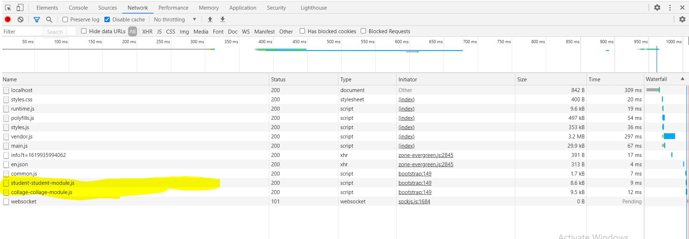

# angular 2 multiple module sample project

## Lazy loading of module
    
## Multiple language configurations

## Module: share 

    It contains the share components. 
    I have created a header component, but any other components which are need to common for the all components that need to create here.

## Module: core

    It will contains the services only.
    It will imported to AppModule only

## Module: student

    It contains all the components related to studet managements.

## Module: Collage

     It contains all the components related to collage managements.
